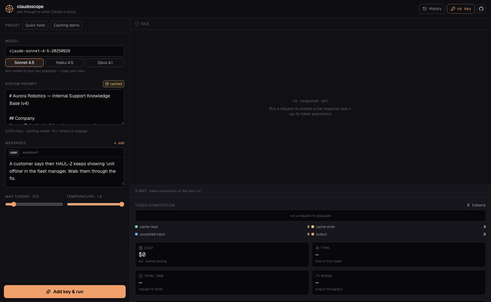

# claudoscope

[](LICENSE)
[](https://github.com/ferhatatagun/claudoscope/stargazers)
[](#)
[](#)
[](https://claudoscope-labs.vercel.app)

**See through to what Claude is doing.**

A bring-your-own-key playground for the Anthropic Messages API that *visualizes*
the parts you normally never see — prompt caching, token composition, latency,
and cost — in real time, as the response streams.

No backend. No accounts. Your API key never leaves your browser.

**[Live → claudoscope-labs.vercel.app](https://claudoscope-labs.vercel.app)** ·
**[See it with no key → claudoscope-labs.vercel.app/?demo=1](https://claudoscope-labs.vercel.app/?demo=1)**



> No API key handy? Open [**`/?demo=1`**](https://claudoscope-labs.vercel.app/?demo=1)
> to land straight on a sample run — the screenshot above is exactly that view.

---

## Why

Most people call the Claude API and see two numbers: input tokens and output
tokens. But a single request is actually four different things being billed at
four different rates:

| Segment | What it is | Rate |
| --- | --- | --- |
| **cache read** | input served from the prompt cache | ~10% of input |
| **cache write** | input freshly written into the cache | ~125% of input |
| **uncached input** | everything else you sent | full input price |
| **output** | what Claude generated | 5× input price |

Prompt caching can cut cost by ~90% on the cached portion — but only if you can
*see* whether your cache is actually hitting. claudoscope makes that visible.

## What it does

- **BYOK, zero backend** — the request goes straight from your browser to
  `api.anthropic.com`. The key lives in `localStorage`, nowhere else.
- **Live streaming** — responses render token-by-token over raw SSE.
- **The X-Ray panel** — a stacked bar breaks every request into cache read /
  cache write / uncached input / output, with exact counts.
- **Real economics** — estimated cost, time-to-first-token, total latency,
  output throughput (tokens/sec), and a cache-impact readout showing exactly
  how much a cache hit saved you.
- **Cost delta** — every run's cost is compared to the one before it, so the
  caching demo lands: the second run visibly drops ~70%.
- **Caching demo built in** — a preset with a long cached system prompt. Run it
  twice and watch the yellow *cache write* turn into a green *cache read*.
- **Session history** — the last 25 runs are saved locally with a cost-per-run
  bar chart; click any run to restore the full request and its x-ray.
- **Sample mode** — no key? Hit *Preview with sample data* (or open `?demo=1`)
  to see the whole tool populated with a representative run.

## The caching demo

1. Open the app, add your Anthropic API key.
2. Pick the **Caching demo** preset (loads a long, cache-enabled system prompt).
3. Run it once → the X-Ray shows a **cache write** (yellow) — a one-time premium.
4. Run the *same* request again within 5 minutes → that segment turns into a
   **cache read** (green), and the cache-impact panel shows the money saved.

That green-vs-yellow flip is the whole point of prompt caching, made visible.

## How it works

```
src/
  app/
    page.tsx          orchestration: state, run loop, keyboard shortcuts
    layout.tsx        fonts, metadata
    globals.css       design tokens, dark theme
  components/
    RequestPane.tsx   model · system prompt · messages · params
    OutputPane.tsx    streaming response + status
    XRayPanel.tsx     token-composition bar + cost + latency
    HistoryDrawer.tsx local run history
    KeyDialog.tsx     BYOK key entry
  lib/
    anthropic.ts      fetch-based streaming client + manual SSE parser
    pricing.ts        tier-aware cost model
    presets.ts        example requests (incl. the caching demo)
    storage.ts        localStorage helpers
```

The Anthropic SDK is intentionally **not** used: its agent-toolset entry pulls
in Node-only modules that break browser bundling. Talking to the Messages API
directly over `fetch` keeps the bundle lean and puts the SSE parsing — the part
worth showing — in plain sight (`lib/anthropic.ts`).

Cost is derived from the model *tier* (opus / sonnet / haiku detected from the
model name), so dated snapshots and future minor versions still get a sensible
estimate. Update the numbers in `lib/pricing.ts` when pricing changes.

## Run locally

```bash
npm install
npm run dev
# open http://localhost:3000
```

You'll need an Anthropic API key — create one at
[console.anthropic.com](https://console.anthropic.com/settings/keys).

## Deploy

Any static-friendly host works. One-click on Vercel:

[](https://vercel.com/new/clone?repository-url=https://github.com/ferhatatagun/claudoscope)

There are no environment variables — the key is supplied by the user at runtime.

## Privacy

- The API key is stored only in your browser's `localStorage`.
- Requests go directly to Anthropic; nothing is proxied, logged, or persisted
  server-side (there is no server).
- Run history lives in `localStorage` and can be cleared from the History panel.

## Read the story

Two long-form write-ups that explain how this was built and why it
visualizes what it does:

- [**Building a streaming Claude client in the browser — without the SDK**](https://ferhatatagun.com/blog/browser-only-claude-streaming)
  — the ~150-line SSE parser that powers this tool, why I skipped the official
  Anthropic SDK for browser work, and how `tool_use` deltas accumulate.
- [**Prompt caching is the cheapest Claude optimization. Nobody measures it.**](https://ferhatatagun.com/blog/prompt-caching-nobody-measures)
  — the four `usage` fields most apps log nowhere, why hit ratio is the
  metric that pays for itself in a week, and the cache misconfigurations
  this tool surfaces in one glance.

## Tech

Next.js 16 · React 19 · TypeScript · Tailwind CSS v4 · Framer Motion

## A small suite

Four tools for seeing what Claude is doing, built together with a shared design language:

- **claudoscope** — x-ray your Claude API calls *(this one)*
- [agent-replay](https://github.com/ferhatatagun/agent-replay) — replay an agent's tool-calling loop
- [prompt-lab](https://github.com/ferhatatagun/prompt-lab) — A/B test prompts side by side
- [tool-lab](https://github.com/ferhatatagun/tool-lab) — interactive tool-use sandbox

## License

MIT — see [LICENSE](LICENSE).
